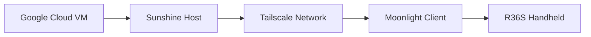

<div align="center">


<br>

<p align="center">


</p>

<h3>
Portable AAA Gaming On Your R36S
</h3>

<p>
Stream demanding PC games directly from the cloud with low latency and high performance.
</p>

<br>


</div>

---

# 📖 Overview

The goal of this project is to transform the **R36S** into a portable cloud gaming device capable of running modern AAA PC games through cloud streaming technology.

Using:

* ☁️ Google Cloud
* 🌐 Tailscale
* 🎥 Sunshine
* 📱 Moonlight

the R36S can stream games such as:

* GTA V
* DOOM Eternal
* Titanfall 2
* Wolfenstein II
* Resident Evil 2 Remake
* Forza Horizon 4

---

# ⚡ Architecture

<div align="center">



</div>

---

# 🛠 Technology Stack

| Component        | Purpose                  |
| :--------------- | :----------------------- |
| **Google Cloud** | Virtual machine hosting  |
| **Sunshine**     | Game streaming host      |
| **Moonlight**    | Streaming client         |
| **Tailscale**    | Secure remote networking |

---

# ⚙️ Installation Guide

## 1️⃣ Create A Google Cloud Notebook

Create a new notebook instance inside Google Cloud.

> Click **New Notebook**

---

## 2️⃣ Import The Notebook File

Download the provided `.ipynb` notebook:

```text id="jlwm7m"
https://drive.google.com/file/d/1TO3Is-qrXugqUVFbtxN86XQ_eFqNdIBq/view?usp=sharing
```

Paste the notebook contents into your Google Colab environment.

---

## 3️⃣ Start The Virtual Machine

Launch the VM and wait until everything finishes loading.


> The screenshot interface is currently in Spanish.

---

<div align="center">


</div>

---

# ⚠️ Requirements

Before starting the VM, install:

* Tailscale
* Sunshine

### Supported Operating Systems

| Status        | Operating System |
| :------------ | :--------------- |
| ✅ Supported   | LineageOS        |
| ❌ Unsupported | ArkOS            |
| ❌ Unsupported | DarkOS           |

---

# 💻 Cloud Machine Specifications

<div align="center">

|       GPU       |             CPU             |    RAM   | Operating System |
| :-------------: | :-------------------------: | :------: | :--------------: |
| NVIDIA Tesla T4 | Intel Xeon 2 Cores @ 2.0GHz | 12.67 GB |    Tiny10 LTS    |

</div>

---

# 🎮 Game Showcase

## DOOM Eternal


---

## Metal Gear Solid V: The Phantom Pain


---

## Titanfall 2


---

<div align="center">


</div>

---

## Wolfenstein II: The New Colossus


---

## Sniper Elite 4


---

## Mad Max


---

## Batman: Arkham Knight


---

## Rise of the Tomb Raider


---

<div align="center">


</div>

---

## Grand Theft Auto V


---

## Alien: Isolation


---

## Resident Evil 2 Remake


---

## Devil May Cry 5


---

## BioShock Infinite


---

## Hades


---

## Forza Horizon 4


---

<div align="center">


</div>

---

# 🚧 Future Improvements

* More handheld support
* ArkOS compatibility
* Simplified deployment scripts
* Better streaming optimization
* Automatic setup process

---

<div align="center">

### ⭐ If you like this project, consider giving it a star.

<br>


<br><br>


</div>
