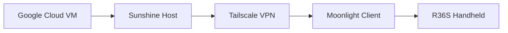

<div align="center">


<br>

<p align="center">
  
  
  
  
  
</p>

<h3>
🎮 Portable AAA Gaming On Your R36S
</h3>

<p>
Transform your handheld console into a cloud gaming machine capable of streaming modern PC games with low latency and high performance.
</p>

<br>


</div>

---

# 📚 Table Of Contents

* Overview
* Features
* Streaming Architecture
* Technology Stack
* Installation Guide
* Requirements
* Supported Operating Systems
* Cloud Specifications
* Game Showcase
* Future Improvements

---

# 📖 Overview

This project aims to turn the **R36S** into a fully functional cloud gaming handheld using a remote virtual machine and game streaming technologies.

Using:

* ☁️ Google Cloud
* 🌐 Tailscale
* 🎥 Sunshine
* 📱 Moonlight

you can remotely stream demanding AAA PC games directly onto your handheld console.

Supported games include:

* Grand Theft Auto V
* DOOM Eternal
* Titanfall 2
* Wolfenstein II
* Resident Evil 2 Remake
* Forza Horizon 4
* Batman: Arkham Knight
* Devil May Cry 5

---

# ✨ Features

✅ Low latency game streaming
✅ Portable AAA gaming experience
✅ Cloud-powered virtual machine
✅ Optimized for LineageOS
✅ Tesla T4 GPU acceleration
✅ Easy deployment using Google Colab

---

# ⚡ Streaming Architecture

<div align="center">


</div>



---

# 🛠 Technology Stack

| Component        | Purpose                          |
| :--------------- | :------------------------------- |
| **Google Cloud** | Hosts the gaming virtual machine |
| **Sunshine**     | Streams the desktop and games    |
| **Moonlight**    | Streaming client for the R36S    |
| **Tailscale**    | Secure VPN networking            |

---

# ⚙️ Installation Guide

## 1️⃣ Create A Google Cloud Notebook

Create a new notebook instance inside Google Cloud.

After opening the dashboard, click:

> **New Notebook**

---

## 2️⃣ Import The Notebook File

Download the provided `.ipynb` notebook:

```text id="wyyfpk"
https://drive.google.com/file/d/1TO3Is-qrXugqUVFbtxN86XQ_eFqNdIBq/view?usp=sharing
```

Then paste the notebook contents into your Google Colab environment.

---

## 3️⃣ Start The Virtual Machine

Launch the virtual machine and wait until the environment finishes loading.


> Note: The screenshot interface is currently in Spanish.

---

<div align="center">


</div>

---

# ⚠️ Requirements

Before starting the VM, install the following applications:

| Application | Required |
| :---------- | :------: |
| Tailscale   |     ✅    |
| Sunshine    |     ✅    |

---

# 📱 Supported Operating Systems

| Status        | Operating System |
| :------------ | :--------------- |
| ✅ Supported   | LineageOS        |
| ❌ Unsupported | ArkOS            |
| ❌ Unsupported | DarkOS           |

---

# 💻 Cloud Machine Specifications

<div align="center">


</div>

|       GPU       |             CPU             |    RAM   | Operating System |
| :-------------: | :-------------------------: | :------: | :--------------: |
| NVIDIA Tesla T4 | Intel Xeon 2 Cores @ 2.0GHz | 12.67 GB |    Tiny10 LTS    |

---

# 🎮 Game Showcase

## 🔥 DOOM Eternal


---

## ⚔️ Metal Gear Solid V: The Phantom Pain


---

## 🤖 Titanfall 2


<div align="center">


</div>

---

## 🐺 Wolfenstein II: The New Colossus


---

## 🎯 Sniper Elite 4


---

## 🚗 Mad Max


---

## 🦇 Batman: Arkham Knight


---

## 🏹 Rise of the Tomb Raider


---

## 🚓 Grand Theft Auto V


---

## 👽 Alien: Isolation


---

## 🧟 Resident Evil 2 Remake


---

## ⚔️ Devil May Cry 5


---

## 🌊 BioShock Infinite


---

## 🔥 Hades


---

## 🏎️ Forza Horizon 4


---

<div align="center">


</div>

---

# 🚧 Future Improvements

* Additional handheld support
* ArkOS compatibility
* Easier setup process
* Better streaming optimization
* Automatic deployment scripts
* Custom launcher support

---

# ⭐ Support The Project

If you enjoy this project, consider giving it a star on GitHub.

<div align="center">

<br>


<br><br>


</div>
