<div align="center">


<br>

<p align="center">
  
  
  
  
  
  
</p>

<h3>
Portable Cloud Gaming For The R36S
</h3>

<p>
Run your Steam games directly onto your R36S Handheld!
</p>

<br>


<br><br>


</div>

---

# Overview

The goal of this project is to transform the **R36S** into a portable cloud gaming machine capable of streaming demanding modern PC games using a cloud-hosted virtual machine.

Powered by:

* Google Cloud (Creates VM)
* Tailscale (Connects via VPN both Google Cloud VM and R36S Handheld)
* Sunshine (Streams The PC Image and Connects it)
* Moonlight (Allows you to control the Machine)

this setup allows you to play high-end PC titles directly from your handheld console almost anywhere.

---

# Features

<div align="center">

| Feature            | Description                      |
| :----------------- | :------------------------------- |
| AAA Streaming   | Play demanding PC games remotely |
| Low Latency      | Smooth Moonlight streaming       |
| Cloud Powered   | Google Cloud VM hosting          |
| Portable        | Full handheld gaming experience  |
| GPU Accelerated | NVIDIA Tesla T4                  |
| Customizable    | Easy to modify and improve       |

</div>

---

# Streaming Architecture

<div align="center">


</div>

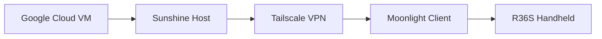

---

# Technology Stack

| Component        | Purpose                          |
| :--------------- | :------------------------------- |
| **Google Cloud** | Hosts the gaming virtual machine |
| **Sunshine**     | Streams the desktop and games    |
| **Moonlight**    | Streaming client for R36S        |
| **Tailscale**    | Secure VPN networking            |

---

# Installation Guide

## Create A Google Cloud Notebook

Create a new notebook instance inside Google Cloud.

> Click **New Notebook**

---

##  Import The Notebook File

Download the `.ipynb` notebook:

```text id="7vlwqa"
https://drive.google.com/file/d/1TO3Is-qrXugqUVFbtxN86XQ_eFqNdIBq/view?usp=sharing
```

Then paste the notebook contents into your Google Colab environment.

---

## Start The Virtual Machine

Launch the VM and wait until the environment finishes loading.


> The screenshot interface is currently in Spanish.

---

<div align="center">


</div>

---

# Requirements

Before starting the VM, install:

<div align="center">

| Application | Required |
| :---------- | :------: |
| Tailscale   |     ✅    |
| Sunshine    |     ✅    |

</div>

---

# Supported Operating Systems

| Status        | Operating System |
| :------------ | :--------------- |
| Supported   | LineageOS        |
| Unsupported | ArkOS            |
| Unsupported | DarkOS           |

---

# Cloud Specifications

<div align="center">


</div>

  |       GPU       |             CPU             |    RAM   | Operating System |
  | :-------------: | :-------------------------: | :------: | :--------------: |
  | NVIDIA Tesla T4 | Intel Xeon 2 Cores @ 2.0GHz | 12.67 GB |    Ubuntu LTS    |


---

# Game Showcase

## DOOM Eternal


---

## Metal Gear Solid V: The Phantom Pain


---

## Titanfall 2


<div align="center">


</div>

---

## Wolfenstein II: The New Colossus


---

## Sniper Elite 4


---

## Mad Max


---

## Batman: Arkham Knight


---

## Rise of the Tomb Raider


---

## Grand Theft Auto V


---

## Alien: Isolation


---

## Resident Evil 2 Remake


---

## Devil May Cry 5


---

## BioShock Infinite


---

## Hades


---

## Forza Horizon 4


---

## Cyberpunk 2077

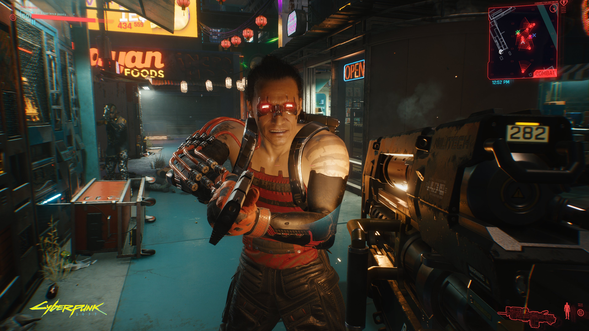

---

## Marvel's Spider-Man Remastered

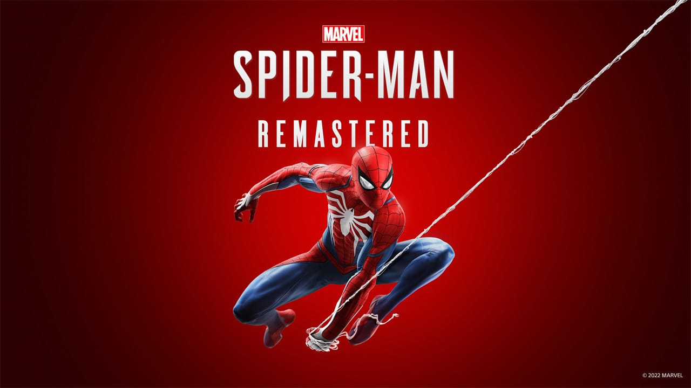

---

## Elden Ring

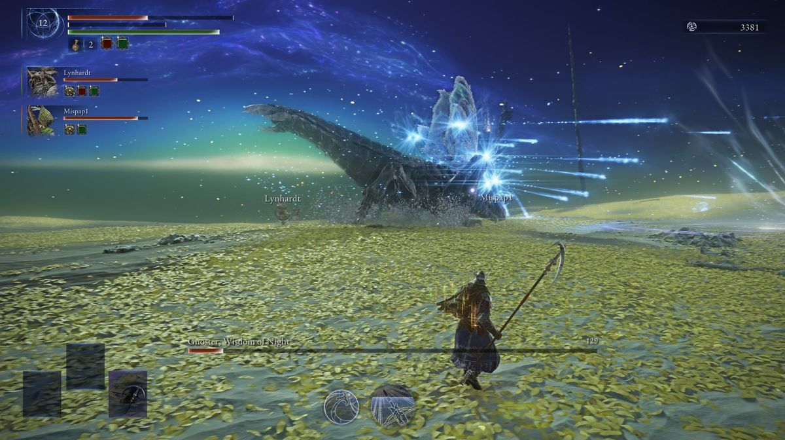

<div align="center">


</div>

---

## Red Dead Redemption 2

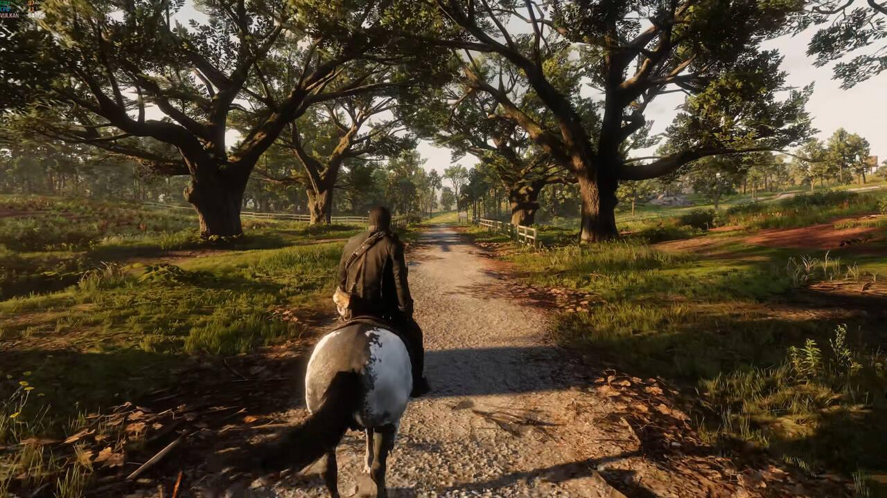

---

## Fallout 4

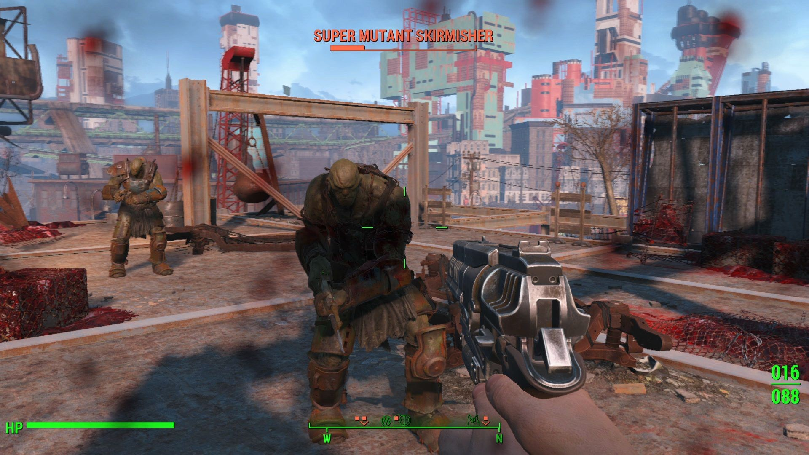

---

## Dying Light

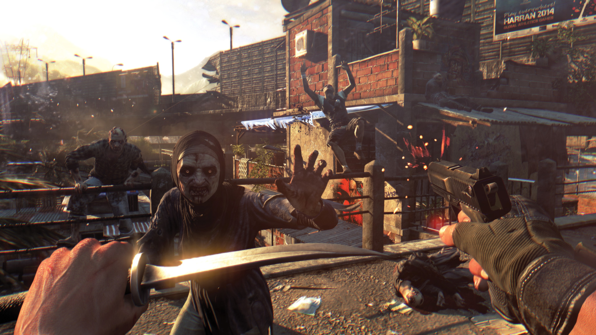

<div align="center">


</div>

---

## Halo Infinite

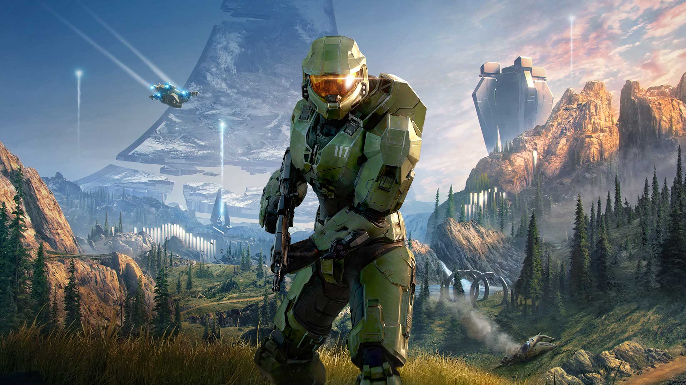

---

## Call Of Duty: Modern Warfare

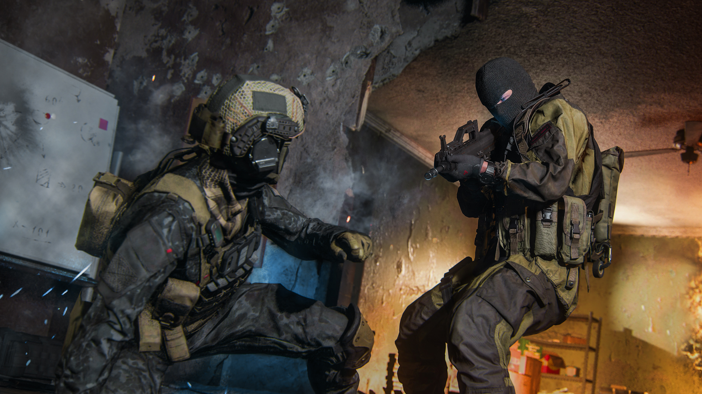

---

## Half-Life 2

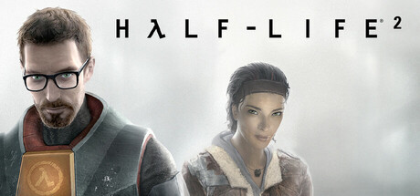

---

## Fallout 76

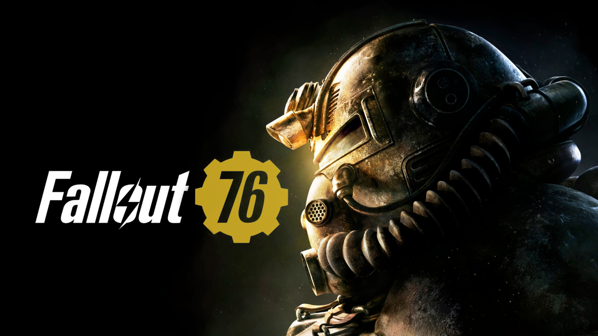

---

## Hollow Knight (Android and PC)

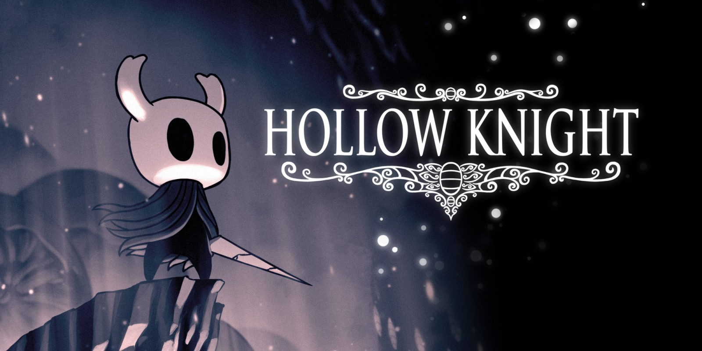

---

# Future Improvements

* Additional handheld support
* ArkOS compatibility
* Easier setup process
* Automatic deployment scripts
* Better latency optimization
* Steam Big Picture integration
* Remote launcher support
* Performance presets

---

# ⭐ Support The Project

<div align="center">

If you like this project, consider giving it a ⭐ on GitHub.

<br><br>

# Frequently Asked Questions (FAQ)
A: How can I play these games on my Handheld?
B: You will have to install Lineage OS on a separate SD Card or the one you own, also you need a wifi dongle and the moonlight and tailscale apk's, You can find them both on the internet.
A: Is the project safe?
B: Yes, the VM is created in Google Colab (Google Cloud) so there will be no major problem.
A: Are the APK's safe?
B: Yes, as long as you watch out from where you are downloading it.


<br><br>

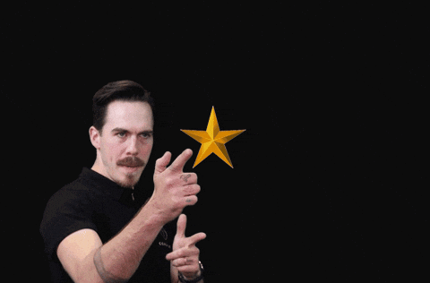

<br><br>


</div>
