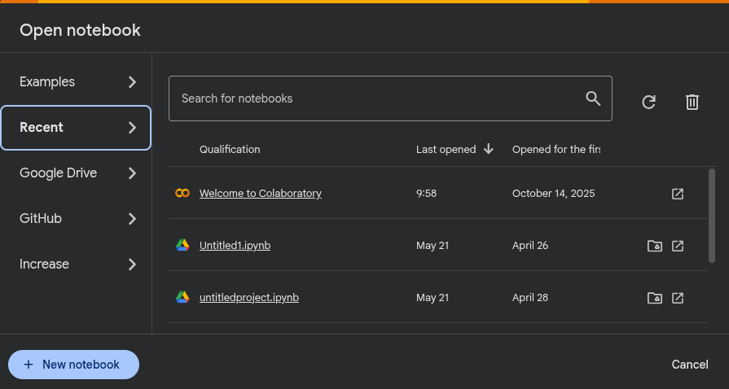
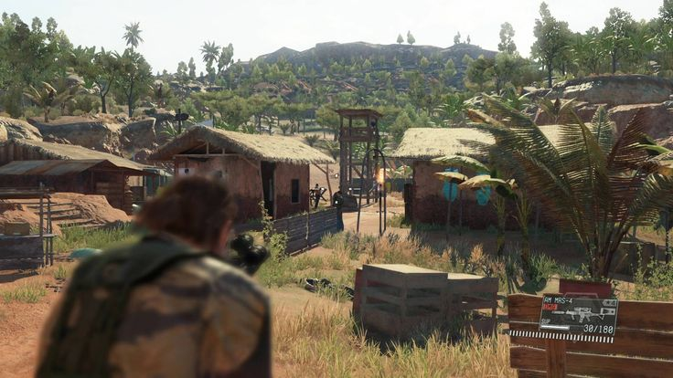
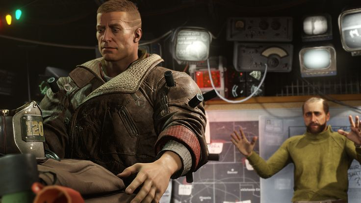
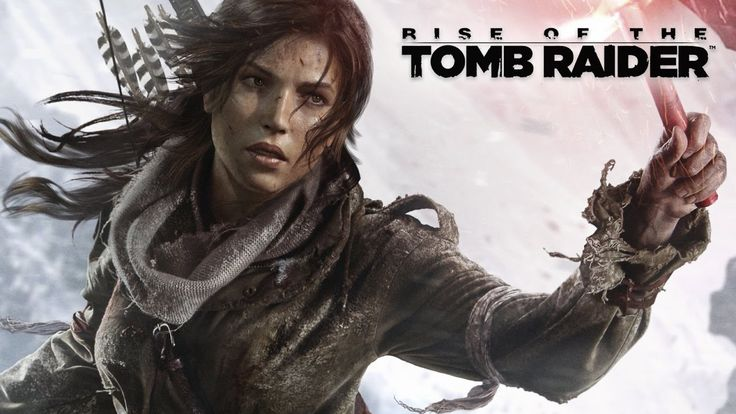
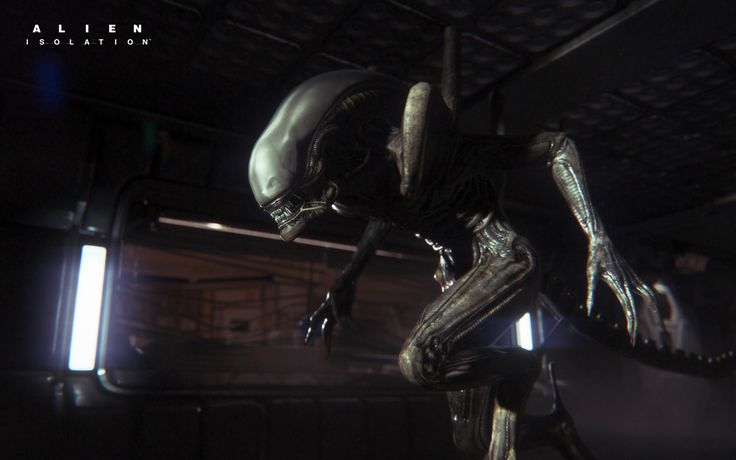
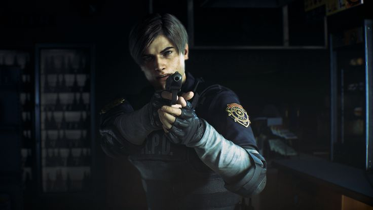
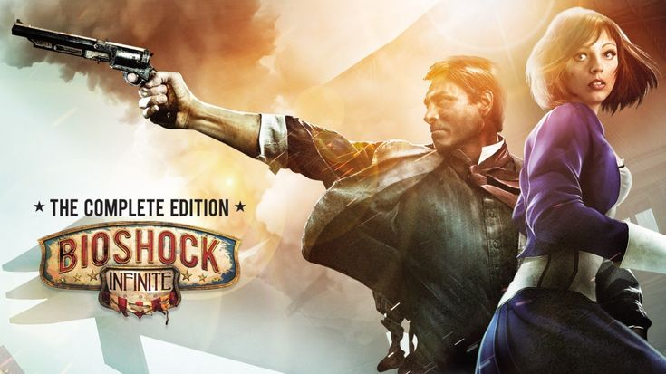
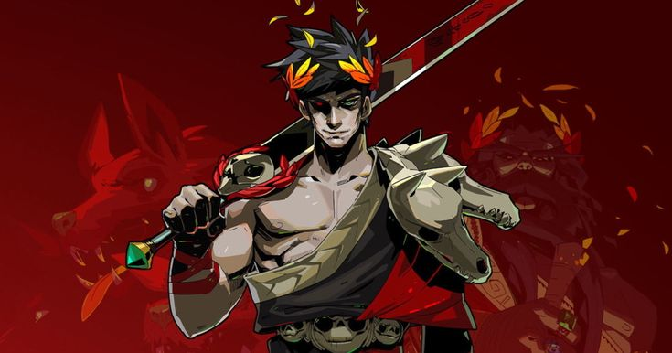

<div align="center">


<br>


<br><br>

<p align="center">


</p>

### 🎮 Portable AAA Gaming On A Handheld Console

Stream high-end PC games directly from the cloud to your **R36S** using a low-latency game streaming setup.

<div align="center">  </div>

---

# 📖 Overview

The purpose of this project is to transform the **R36S** into a portable cloud gaming device capable of running modern AAA games through a cloud-hosted virtual machine.

Using technologies like:

* ☁️ Google Cloud
* 🌐 Tailscale
* 🎥 Sunshine
* 📱 Moonlight

You can play demanding titles remotely with excellent performance and low latency.

---

<div align="center">

# ⚡ Streaming Architecture


</div>

---

# 🛠 Technology Stack

| Component        | Purpose                          |
| :--------------- | :------------------------------- |
| **Google Cloud** | Hosts the gaming virtual machine |
| **Sunshine**     | Streams the desktop and games    |
| **Moonlight**    | Client used on the R36S          |
| **Tailscale**    | Secure VPN connection            |

---

# ⚙️ Installation Guide

## 1️⃣ Create A Google Cloud Notebook

Create a new notebook instance inside Google Cloud.


After opening the dashboard, click:

> **New Notebook**

---

## 2️⃣ Import The Notebook File

Download the `.ipynb` notebook below:

```text
https://drive.google.com/file/d/1TO3Is-qrXugqUVFbtxN86XQ_eFqNdIBq/view?usp=sharing
```

Then paste the notebook contents into your Google Colab environment.

---

## 3️⃣ Start The Virtual Machine

Launch the virtual machine and wait until the setup finishes loading.



> The interface shown in the screenshot is currently in Spanish.

---

# ⚠️ Requirements

Before starting the VM, install:

<div align="center">

| Application | Required |
| :---------- | :------: |
| Tailscale   |     ✅    |
| Sunshine    |     ✅    |

</div>

---

# 📱 Supported Operating Systems

| Status        | Operating System |
| :------------ | :--------------- |
| ✅ Supported   | LineageOS        |
| ❌ Unsupported | ArkOS            |
| ❌ Unsupported | DarkOS           |

---

# 💻 Cloud Machine Specifications

<div align="center">


<br><br>

|       GPU       |               CPU              |    RAM   | Operating System |
| :-------------: | :----------------------------: | :------: | :--------------: |
| NVIDIA Tesla T4 | Intel Xeon<br>2 Cores @ 2.0GHz | 12.67 GB |    Tiny10 LTS    |

</div>

---

# 🎮 Game Showcase

## 🔥 DOOM Eternal


---

## ⚔️ Metal Gear Solid V: The Phantom Pain



---

## 🤖 Titanfall 2


---

## 🐺 Wolfenstein II: The New Colossus



---

## 🎯 Sniper Elite 4


---

## 🚗 Mad Max


---

## 🦇 Batman: Arkham Knight


---

## 🏹 Rise of the Tomb Raider



---

## 🚓 Grand Theft Auto V


---

## 👽 Alien: Isolation



---

## 🧟 Resident Evil 2 Remake



---

## ⚔️ Devil May Cry 5


---

## 🌊 BioShock Infinite



---

## 🔥 Hades



---

## 🏎️ Forza Horizon 4


---

# 🚧 Future Improvements

* Additional handheld support
* ArkOS compatibility
* Automatic deployment scripts
* Better streaming optimization
* Easier installation process

---

<div align="center">

## ⭐ Support The Project

If you like this project, consider giving it a star on GitHub.

<br>


<br><br>


</div>
